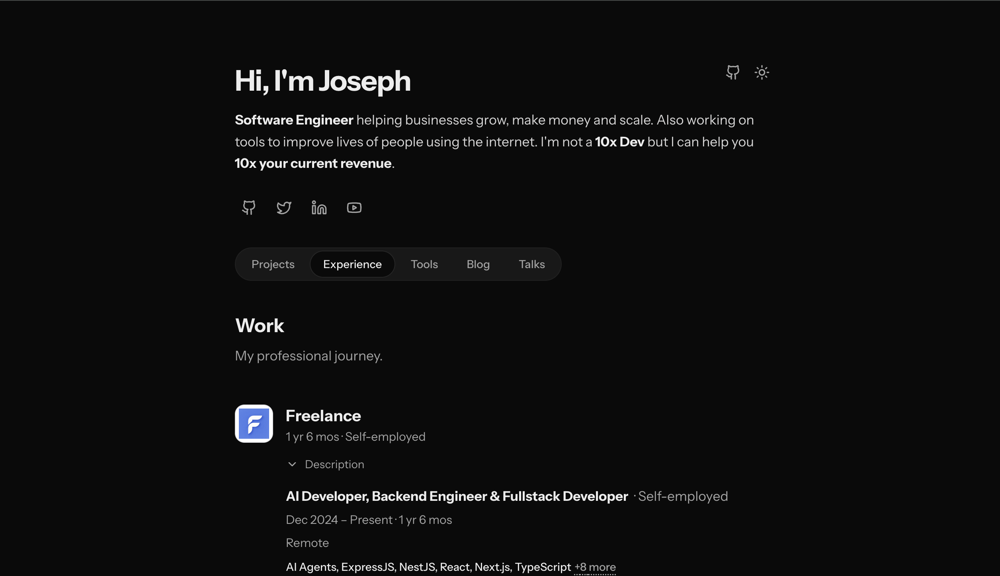

# JC Coder Portfolio 🚀

A modern, high-performance portfolio website built with **TanStack Start**, **React**, and **Tailwind CSS v4**. This version is optimized for speed, SEO, and aesthetics, featuring dynamic animations and a clean professional layout.

## Design Preview



---

## 🛠 Tech Stack

- **Framework**: [TanStack Start](https://tanstack.com/start) (Full-stack React with TanStack Router + Vite)
- **Styling**: [Tailwind CSS v4](https://tailwindcss.com/) & [Radix UI](https://www.radix-ui.com/)
- **Components**: [Shadcn/UI](https://ui.shadcn.com/)
- **State & Routing**: [TanStack Router](https://tanstack.com/router)
- **Validation**: [Zod](https://zod.dev/)
- **Analytics**: [PostHog](https://posthog.com/) & [Google Analytics](https://analytics.google.com/)
- **CMS**: [Sanity](https://www.sanity.io/)
- **Deployment**: [Netlify](https://www.netlify.com/)
- **Language**: [TypeScript](https://www.typescriptlang.org/)

---

## 🚀 Getting Started

### Prerequisites

- [Node.js](https://nodejs.org/) (v18+ recommended)
- npm or pnpm

### Installation

1. Clone the repository:

   ```bash
   git clone <your-repo-url>
   cd my-portfolio-v2
   ```

2. Install dependencies:

   ```bash
   npm install
   ```

3. Start development server:
   ```bash
   npm run dev
   ```
   The site will be available at `http://localhost:3000`.

---

## ✍️ How to Edit Content

The site supports two content sources:

- **Sanity CMS** for profile, social links, projects, experience, education, blog posts, and speaking engagements.
- **Hardcoded data** in `src/data/portfolio.ts` as a fallback and for tools.

The frontend tries Sanity first. If Sanity is empty or unavailable, it falls back to `src/data/portfolio.ts`.

### Sanity Content

Sanity Studio lives in:

```text
studio/
```

Schemas live in:

```text
studio/schemaTypes/
```

Frontend queries live in:

```text
src/data/sanityPortfolio.ts
```

Sanity client config lives in:

```text
src/lib/sanity.ts
```

Shared Sanity project defaults live in:

```text
sanity.shared.ts
```

To run Studio locally:

```bash
cd studio
npm run dev
```

To deploy Studio to Sanity:

```bash
cd studio
npm run deploy
```

After deployment, edit and publish content from your `*.sanity.studio` URL.

### Hardcoded Content

The fallback portfolio data lives in:

```text
src/data/portfolio.ts
```

Use this file when:

- You want local fallback content.
- You want to update tools, because tools intentionally live in code.
- You want to seed Sanity from existing hardcoded data.

Tools are rendered from:

```text
portfolioData.tools
```

There is no Sanity schema for tools.

### Seeding Sanity From Hardcoded Data

If you already have content in `src/data/portfolio.ts`, seed it into Sanity with:

```bash
SANITY_WRITE_TOKEN=your_write_token npm run sanity:seed
```

The seed script lives in:

```text
scripts/seed-sanity.ts
```

It seeds:

- profile
- social links
- projects
- experience
- education
- blog posts
- speaking engagements

It does not seed tools.

The script uses stable document IDs and `createOrReplace`, so running it again updates the same seeded documents instead of creating duplicates.

Create a write token in Sanity Manage:

```text
Project Settings → API → Tokens
```

Do not commit write tokens or expose them with a `VITE_` prefix.

### 2. SEO & Metadata

Meta tags, OG images, and page titles are managed in:
👉 `src/lib/seo.ts`

- Update `SITE_URL` to your production domain.
- Modify `DEFAULT_SEO` for site-wide settings.
- Customize `PAGE_SEO` for specific routes (Home, Projects, etc.).

### 3. Media & Assets

Images and logos should be placed in the `public/` directory:

- **Project Logos**: `public/projects-logo/`
- **OG Image**: `public/og-image-jc.jpg`
- **Social Icons**: Managed via `lucide-react` in components or internal logic.

---

## 🔑 Environment Variables

To enable analytics and other services, create a `.env.local` file in the root directory:

```env
VITE_PUBLIC_POSTHOG_KEY=your_posthog_key
VITE_PUBLIC_POSTHOG_HOST=https://app.posthog.com
VITE_PUBLIC_GA_ID=your_google_analytics_id
VITE_SANITY_PROJECT_ID=f4c27e9l
VITE_SANITY_DATASET=production
VITE_SANITY_API_VERSION=2026-03-01
```

`VITE_SANITY_PROJECT_ID`, `VITE_SANITY_DATASET`, and `VITE_SANITY_API_VERSION` are safe to expose because they are used for public reads.

Never expose this in frontend code:

```env
SANITY_WRITE_TOKEN=your_write_token
```

Only pass `SANITY_WRITE_TOKEN` when running local scripts.

---

## 📊 Analytics & Tracking

This project is integrated with two powerful analytics tools:

1.  **PostHog**: Used for deep product analytics, session recordings, and feature flags. Configuration resides in `src/routes/__root.tsx`.
2.  **Google Analytics**: Used for high-level traffic analysis. The GTAG script is automatically injected if `VITE_PUBLIC_GA_ID` is present in your environment variables.

---

## 🏗 Project Structure

- `src/routes/`: TanStack Router file-based routing.
- `src/components/`: Reusable UI components (Shadcn + Custom).
- `src/data/`: Static fallback data and Sanity query helpers.
- `src/lib/`: Utility functions and SEO configurations.
- `studio/`: Sanity Studio and content schemas.
- `public/`: Static assets (images, redirects, robots.txt, sitemap).

---

## 🚢 Deployment

The project is configured for **Netlify**.

1. Build for production:
   ```bash
   npm run build
   ```
2. The output will be in the `.output` directory.
3. Push to GitHub and connect to Netlify for automatic deployments (configured via `netlify.toml`).

---

## 🧪 Testing & Linting

- **Test**: `npm run test` (Vitest)
- **Lint**: `npm run lint`
- **Format**: `npm run format`
- **Full Check**: `npm run check`

---

Built with ❤️ by [JC Coder](https://jccoder.xyz)
